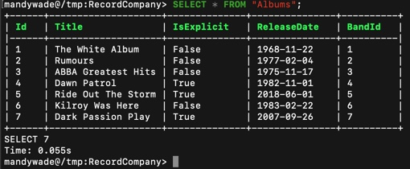
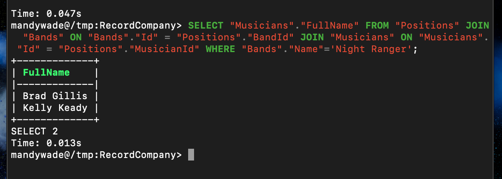

# RhythmsGonnaGetYou

The objective of this project, was to model and create a database. This database stored bands, albums, songs, and band members from Vinyl in my personal collection. Then I created a console app that allowed the user to interact with the database. This particular project followed the [CRUD](https://developer.mozilla.org/en-US/docs/Glossary/CRUD) (Create, Read, Update, Delete) method.

How I broke down the [Problem](https://github.com/MandyW0312/RhythmsGonnaGetYou/blob/master/PEDAC.md).

The following technologies were used:

- [SQL](https://developer.mozilla.org/en-US/docs/Glossary/SQL)
- [ORMs](https://hibernate.org/orm/what-is-an-orm/) (EF Core)

